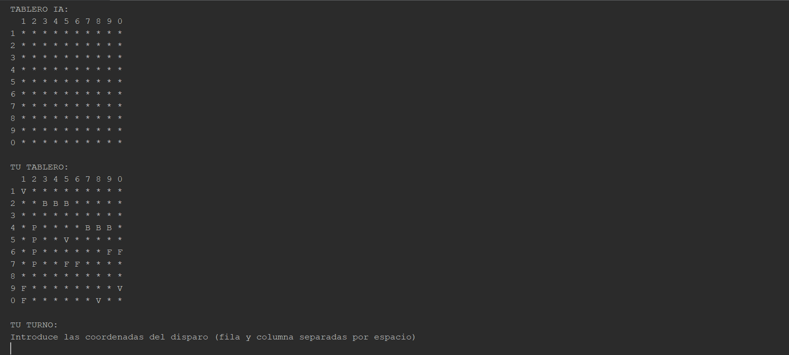

# 🚢💥 HundirLaFlota 

**HundirLaFlota** es una implementación hecha en Java del clásico juego donde dos jugadores se enfrentan para hundir los barcos del otro. El juego se juega únicamente en la consola, sin necesidad de interfaz gráfica.

## 💡 Características

- Jugador vs Jugador
- Tablero de 10x10 para cada jugador
- El jugador puede colocar sus barcos de manera estratégica 🚢
- Los ataques se realizan por coordenadas en el tablero 🔫

## 🎮 Cómo jugar

1. **Ejecuta el juego en la consola**:
   java HundirLaFlota
2. **Sigue las instrucciones en pantalla para colocar tus barcos y atacar a los del oponente**
3. **¡El primero en hundir todos los barcos del oponente gana!** 🏆

## 📸 Captura de Pantalla

## ⚙️ Requisitos

- Java 8 o superior ☕
- Consola o terminal para ejecutar el juego 🖥️

## 🔧 Instalación

1. **Clona el repositorio**:
   git clone https://github.com/mariodiazzz11/HundirLaFlota.git
2. **Clona el repositorio**:
   cd HundirLaFlota
3. **Compila el proyecto (si es necesario)**:
   javac *.java

## 🚀 Contribuciones

Si deseas contribuir al proyecto, siéntete libre de hacer un fork y enviar pull requests. ¡Toda ayuda es bienvenida! 🤝

## 📄 Licencia

Este proyecto está bajo la licencia MIT. Para más detalles, consulta el archivo LICENSE.
